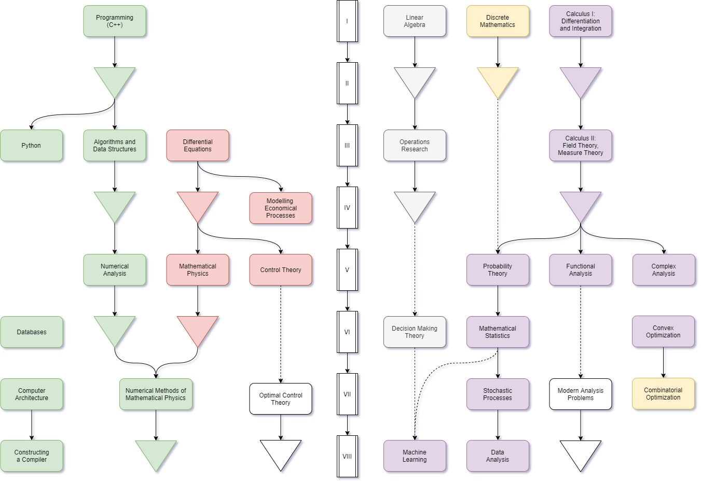

It is a more detailed description of my education.  It includes coursework, grades, achievements, etc.

# Physics and Mathematics Lyceum №208

There is nothing special about it apart from its students earning 14 medals (5G, 7S, 2B) at the IMO over the past ten years (2010&ndash;2019).  Note that Ukraine had 11-years school education when I studied.  Therefore, Ukrainians are usually younger than other Europeans when participating in international olympiads.  For example, I graduated from school when I was 16.

### GPA

I can't remember the exact GPA, but I guess it was about 10.6/12 (in between A and A+) in my last year.  Some other years my GPA was as high as 11.5.  Such a drop is because I focused on preparing for IMO.    Anyway, I graduated with a gold medal (a.k.a. the High Honours).

### Coursework

Coursework includes rather standard things: algebra, geometry, physics, chemistry, biology, geography, history, sports, some languages, some literature, even art and music classes once.

### Achievements

Speaking of achievements, I took part in far too many olympiads to remember all of them.  I guess I will only mention the city level and above:

- 2010 (5th grade):

    - third place at city math olympiad for 7th grade;

- 2011 (6th grade):

    - second place at city math olympiad for 7th grade;

    - second place at city math olympiad for 8th grade;

      <small>Yeah, I wrote the olympiad for two different grades.  Such practice is somewhat unusual, but not prohibited.  In my case it was even strategically advantageous: to get into the selection round of Kyiv team for the national olympiad one had to get either first place in 7th grade or at least second place in 8th grade.  It turns out that the latter is sometimes easier.  By using this loophole in the regulations, I became one of something like five all-time youngest students who entered the selection round.</small>

- 2012:

    - first place at city math olympiad;

- 2013:

    - first place at city chemistry olympiad;

      <small>This one was unexpected.  I thought I only got the knack for math, but it turned out that some preparation makes mathematicians extremely competitive in different subjects.</small>

    - second place at city math olympiad;

      <small>Acidentally, I didn't make the Kyiv math team for the national olympiad.  That selection test was quite controversial, with many people believing that the head of the jury interpreted rules the wrong way.  I am still not sure whether this event turned out to be a bad or a good one in my life overall, but some positive consequences eventually followed.  For example, the rules where significantly clarified to avoid ambiguities i in the future.</small>

    - second diploma at national chemistry olympiad;

      <small>I turned my confusion into a constructive path by refocusing on chemistry for some time.  A month or so of preparation resulted in 4th place at national olympiad.  Ukrainian conversion system to diplomas is the following: top 3 people get the first diploma (gold medal), next 6 participants get second (silver), and from 9 to 12 more contestants get third (bronze).  Mathematicians are somewhat flexible regarding these numbers, with the jury voting for the exact cutoffs based on the difference in points between participants.  For example, I earned only half of a point (out of 140) less than the 3rd place finisher, and the next participant was about 10 points down from me.  On a math olympiad, such a situation most probably would've resulted in me getting the first diploma.  However, chemists are somewhat stranger people, sticking precisely to the suggested cutoffs.</small>

- 2014 (9th grade):

    - second place at city chemistry olympiad;

      <small>I took part in it by inertion, I had no intention of distracting from math too much.</small>

    - first place at city math olympiad;

      <small>The first time I was able to get to the national olympiad.</small>

    - first diploma at national math olympiad;

      <small>This time I was determined to win, despite the political troubles with russia, which made authorities change the hosting city from Kharkiv to Kyiv.  I finally won the first diploma, and outperformed the rest of the Kyiv team, proving that not taking me into the team last year was a mistake.</small>

- 2015 (10th grade):

    - second place at city geography olympiad;

      <small>It is probably the funniest olympiad I ever took part in.  One day of preparation and a lot of general knowledge was enough to get the second place.  Geography teacher was delighted.</small>

    - second place at city physics olympiad;

      <small>Physics olympiads in Ukraine are quite weird.  Seriously, you never get to know why you get the points you get.  The appeal process is obscure, with almost no people getting their marks raised.  Overall, my impressions were not great, and I decided to get back to math.</small>

    - second place at city math olympiad;

      <small>Once you have a place at the Kyiv team secured by last year first diploma you don't pay too much attention to city olympiads, as these are rather boring.  As a consequence, you lose a point here, a point there, and it's enough to finish second.  You don't care much anyway.</small>

    - second diploma at national math olympiad 11th grade;

      <small>I wanted to get to the team selection test for IMO, and it was necessary to compete for 11th grade to get there, and the second diploma was just enough.  I didn't make the IMO team that year, but it was a valuable experience.</small>

- 2016 (11th grade):

    - second place at city linguistics olympiad;

      <small>It was like a first or second time when the linguistics olympiad was official, and I was very excited to take part.  Incredible experience if you ever get tired of solving mathematical challenges all the time.</small>

    - second place at city math olympiad;

    - second diploma at national math olympiad;

    - silver medal at the International Mathematical Olympiad.

      <small>This year was a disaster for the Ukrainian team, which almost always gets some gold medals.  However, I outperformed the rest of the team &mdash; a spoon of honey in a barrel of tar.  Nevertheless, visiting Hong Kong city was a great experience, I met great young mathematicians from all over the globe, and I still keep in touch with some of them.</small>

# Taras Shevchenko National University of Kyiv

Thought to be one of the best Ukrainian universities by many, yet has a hole bunch of problems if you look from the inside.  I entered the department of Cybernetics, which was consequently renamed to the Computer Science and Cybernetics department.  People mainly call is CS or CSC department.  I majored in the Applied Mathematics.  You can read my diploma [here](https://github.com/Sky-Nik/diploma/blob/master/diploma.pdf).

### GPA

94.7/100, the best in group by quite a margin.  However, it depends on how to calculate it.  Officials suggests counting only exams (i.e., no fail/pass classes, even if these give you a grade), and this is exaclty the way used here.  I also graduted with a red diploma (a.k.a. the High Honours).

### Coursework

There are too many classes to list them in a linear fashion.  Hence, I suggest taking a look at the following course tree:

    

        
    

### Achievements

I didn't took part in student olympiad a lot, but when I did I usually won.  All the following are math olympiads.

- 2017 (freshman):

    - first place at university olympiad;

      <small>It is pratically equivalent to city olympiad, as it is open for the students of other universities.</small>

    - first diploma at national olympiad;

    - silver medal at the International Mathematical Olympiad for University Students.

      <small>Visiting Bulgaria once was fun, but it hosts the olympiad every year.  I thought that it is enough for me.</small>

- 2018 (sophomore):

    - first place at university olympiad;

    - first diploma at national olympiad;

      <small>I easily qualified for IMC, but decided not to go there. This year was funny because so did all top three contestans, resulting in the selected and actual team having only one member in common.</small>

- 2019 (junior):

    - first place at university olympiad;

      <small>Decided not to go to the national olympiad.</small>

    - jury member (coordinator) at the [European Girls' Mathematical Olympiad](https://www.egmo.org/people/person1523/).

    - wrote an [article](https://www.awesomemath.org/wp-pdf-files/math-reflections/mr-2019-06/mr_6_2019_ptolemys_sine_lemma.pdf) on olympiad geometry with Fedir Yudin, which was consequently published in [Mathematical Reflections](https://www.awesomemath.org/mathematical-reflections/archives/#toggle-id-4).

- 2020 (senior):

    - second place at university olympiad;

      <small>The youngsters tend to prepare more, whereas the veterans aim to solve interesting and tricky problems rather than earn more points.  I realised that I am already too old for the olympiads, and decided not to go to the national olympiad, which was anyway cancelled because the Covid19 later on.</small>

    - a deputy leader of Computer Science department team at the IMC.

# Yandex School of Data Analysis

# Online Education

