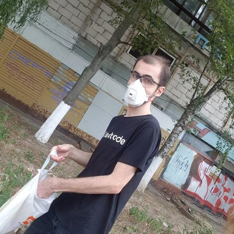

    It is a more detailed description of what exactly I do with programming and why.

<h1>
    Languages
</h1>

<h3>
    C++
</h3>

    I am comfortable with implementing algorithms of any difficult, and particularly like to use the profits of object-oriented programming in the context of algorithms.  We all know that OOP improves the organization of our code, and it comes particularly handy when the overall logic is complex.

    Add a paragraph mentioning specific examples of algorithms that I implemented in OOP fashion.

    I am, however, a bit short on non-standard libraries.  Most of my experience in using such comes from Yandex School of Data Analysis and includes working with the net in POCO (relatively smooth learning curve as compared to Boost Asio), implementing a module for python in C API (unexpectedly easy once you get the boilerplate), and writing a JPEG decoder (man, that was hell).

<h3>
    Python
</h3>

    Generators, co-routines, concurrency, context managers, closures do not surprise me at all.  I even once wrote a Python interpreter in Python (well, a bit incomplete one, but still).  I know many mainstream external libraries, such as Flask, SQLAlchemy, all the ml stuff (tf, keras, scipy, numpy, matplotlib, pandas), and some more.

    Worked as a python analytics backend developer for some time, analyzing the advertisement efficiency via different sources (fb, twi, snap).  Something as routine gets boring very quickly, and I wouldn't like to work in this area again, but still it was a nice commercial experience.

<h3>
    Java
</h3>

    Had a university course with some algorithms with automatons, grammars, regular experssions, and all the stuff, which featured labworks in Java add links to my solutions.  Can't say that I liked Java a lot, but it wasn't difficult or strange either.  Can write a couple of lines with the help of IDE.

<h3>
    Kotlin
</h3>

    Participated in several Codeforces Kotlin Heroes competitions add links to the competitions and to my solutions just for fun.  Solved a couple of problems with the help of google and stackoverflow (regarding the language, not the questions, of course).  Have no other experience with Kotlin, but man it was fun! 

<h1>
    Skills
</h1>

<h3>
    Linux
</h3>

    I have laptops with both Windows and Linux.  Can't say that I use Linux all the time, but it definitely does not seems terrifying to me.  Guess I'll be able to fully adopt any specific tools in a week or so.

    Add a paragraph mentioning specific Linux commands and utilities I am familiar with.

    One last thing, there is an excellent <a href="assets/books/linux-pocket-guide.pdf">book</a> that you definitely should have in yout pocket if you are a Linux user.  In general, I am a bit sceptical about the physical paper books and prefer to google everything, but this one is extremely convenient.  You can order a paperback copy <a href="https://www.amazon.com/Linux-Pocket-Guide-Essential-Commands-dp-1491927577/dp/1491927577">here</a>.

<h3>
    Git
</h3>

    Not the biggest expert, and prefer to be as simple as possible, but can do cherry-pick if needed.  Still, I prefer not do do anything out of ordinary not to confuse other team members, and the same goes with most of my skills.

<blockquote>
    Being smart is good, but being smartass is evil.
</blockquote>

    One last thing, there is an excellent <a href="assets/books/git-pocket-guide.pdf">book</a> that you definitely should have in yout pocket if you are a git user.  In general, I am a bit sceptical about the physical paper books and prefer to google everything, but this one is extremely convenient.  You can order a paperback copy <a href="https://www.amazon.com/Git-Pocket-Guide-Working-Introduction/dp/1449325866">here</a>.

<h1>
    Web
</h1>

    Well, I wrote this entire website.  It isn't something outstanding, but I think it's nice and clear.  Definitely I am not the expert in js, but I can phrase my questions good enough to find the answers in google, effectively copy-pasting the proposed solutions and make them work on my website.  What else can you ask of?

<h1>
    Competetive
</h1>

<h3>
    Codeforces
</h3>

    I registred on Codeforces over three years ago, and like their problems, but don't compete often.  With 28 contest entries to date and 1071 questions solved in the problemset, I have a rating of 2138.  Link to my profile: <a href="https://codeforces.com/profile/Skybytskyi.Nikita" style="color:black;"><b>Master Skybytskyi.Nikita</b></a>.

<h3>
    Codechef
</h3>

    I registred on Codechef over two years ago, and like their Long Challenges, but don't compete often.  With 19 finished contest, my highest rating was 2174.  Link to my profile: <a href="https://www.codechef.com/users/sky_nik" style="color:black;">5&starf; sky_nik</a>.

<h3>
    HackerRank
</h3>

    I registred on HackerRank over three years ago, but they don't host many contests.  With only 8 contest entries, my highest rating was 2185.  I used it rather for learning than for competetive programming.  I have several certificates, badges, and medals there, but have no idea about how valuable or rare those are xD.  Link to my profile: <a href="https://www.hackerrank.com/nskybytskyi">@nskybytskyi</a>.

<h3>
    LeetCode
</h3>

    As you probably already know, LeetCode is more about interview preparation than about competetive programming.  Still, preparing via competing is much more fun.  With 16 finished contest and 774 questions solved in the problemset, my highest rating was 2526.  During these contests and daily challanges I was able to collect enough leetcoins to redeem a T-shirt.  Link to my profile: <a href="https://leetcode.com/nskybytskyi/">@nskybytskyi</a>.

    

        <h5>your face when you get a LeetCode T-shirt</h5>
        
    

<h3>
    Team competitions
</h3>

    Not a big fan of these, but my friends managed to get me involved into two such events.

<h5>
    ACM ICPC &mdash; Stage I of 2019 All-Ukrianian Competition
</h5>

    In April 2019 the team consisting of Andrew Khoma, Alexey Bashuk, and me solved 10/12 problems on the first stage of the All-Ukrainian competition, taking something like 12th place in our region out of about 100 teams.  However, it wasn't good enough to get to the second stage.  To be honest, it felt a bit frustrating, because in math I used to win National level competitions.  Nevertheless, it was a valuable experience.

<h5>
    KPI Open 2019
</h5>

    In July 2019 the team consisting of Matthew Strechen, Stas Tomash, and me solved 8/14 problems on KPI Open, taking the 9th place overall out of about 100 teams.  Again, a dissapointing performance for such a great team, but it was yet another valuable experience.

