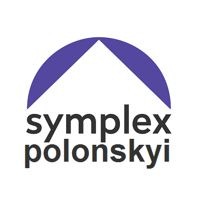
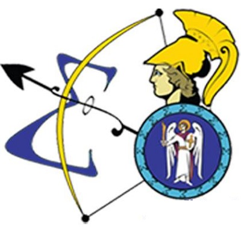
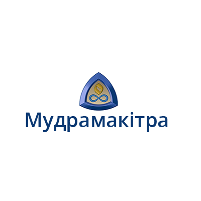
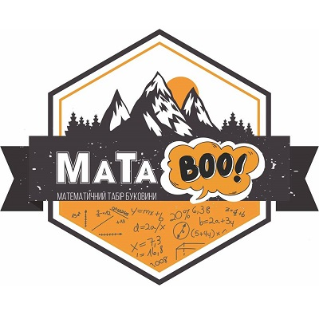
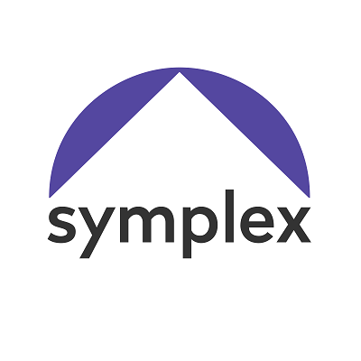
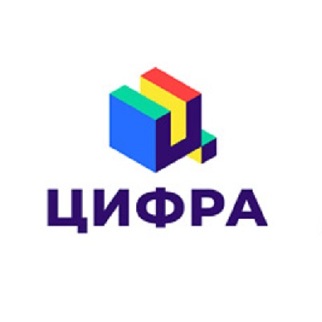
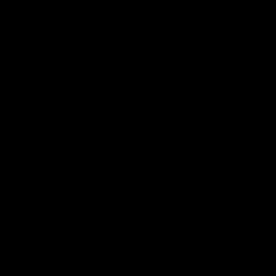

  It is a more detailed description of my teaching experience.  It includes students, classes, lectures, schools, etc.

    

        
    

    

        June'20
    

    

        <h3>
            NIS camp
        </h3>
        

            Nazarbayev Intellectual Schools is a network of high schools in Kazakhstan, created for the most talanted students with the support of the First President.   They regularly have training camps, and this was the second time in a row they invited me to conduct it.  
        

        

            I was invited to prepare their team to the National olympiad, which was rescheduled to the beginning of July (and the rescheduled once again because of the Covid19).  This time we had to work online, which turned out to be just as good as offline.  In particular, we made a fantastic decision to record all the lectures.  Now you can access them <a href="https://www.youtube.com/playlist?list=PL5XMnwBFMSgfhYAR069_s8iKkQYO59BzX">on YouTube</a>.
        

    

    

        <h3>
            Polonskyi
        </h3>
        

            Year-round preparation program for IMO team and reserve.  I was one of the main lecturers for the program, conducting 14 lectures during the year, more than any other mentor.  My lectures are available <a href="https://sky-nik.github.io/teaching/sources/polonskyi/">here</a>.  Beware!  These are quite advanced topics, may be challenging to understand for the beginners and younger students.
        

        

            Our lessons were temporarily paused by Covid19, but resumed again in April, and I returned to the program in May.  I've recorded several videos, and will release them on YouTube soon, for you to get a taste of IMO team preparation. 
        

    

    

        May &ndash; June'20
    

    

        
    

    

        
    

    

        February'20
    

    

        <h3>
            NIS camp
        </h3>
        

            Nazarbayev Intellectual Schools is a network of high schools in Kazakhstan, created for the most talanted students with the support of the First President.   They regularly have training camps, but this was the first time they invited a lecturer from another country, and I'm very proud to be their choice.  
        

        

            I was invited to prepare their team to the National olympiad, which was unfortunately cancelled because of the Covid19.  Nevertheless, children were happy to have two weeks of very extensive preparation (8 hours a day).  You can access my lectures <a href="https://sky-nik.github.io/teaching/sources/Kazakhstan/">here</a>.
        

    

    

        <h3>
            Polonskyi
        </h3>
        

            Year-round preparation program for IMO team and reserve.  It was founded as a division of Symplex school.  I was one of the main lecturers for the program, conducting 14 lectures during the year, more than any other mentor.  My lectures are available <a href="https://sky-nik.github.io/teaching/sources/polonskyi/">here</a>.  Beware!  These are quite advanced topics, may be challenging to understand for the beginners and younger students.
        

    

    

        September'19 &ndash; February'20
    

    

        
    

    

        
    

    

        August'19
    

    

        <h3>
            Mathematical Olymp
        </h3>
        

            Summer math school conducted in Ukrainian Mathematics and Physics Lyceum (UPML) almost anually.  The approximate level of participants was national olympiad diploma and city olympiad prize places.  I was an invited lecturer in grades from 8th to 11th, and conducted several lectures.
        

        

            This year I participated in the school rather as a programme consultant, because of an extensive experience I had.  My job was to coordinate other lecturers to ensure that they have a good understanding of who, when, and in which grade has a lecture about what.  It may not sound very difficult, but it is kinda tricky if you have 15 lecture days, 30 lecturers, and about 300 students.
        

    

    

        <h3>
            Mudramakitra (Smart Head)
        </h3>
        

            Summer math school conducted by my former school anually since 2005.  As a student I participated in it three times, and these summers were cool!
        

        

            The approximate level of participants was national olympiad diploma and city olympiad prize places.  I was an invited lecturer in grades from 7th to 11th, and conducted about a dozen lectures.  A complete collection of my lectures is <a href="./assets/mudramakitra.pdf">here</a>
        

    

    

        August'19
    

    

        
    

    

        
    

    

        July'19
    

    

        <h3>
            MaTaBoo
        </h3>
        

            The best summer math school in Bukovyna, a wonderful countriside near Karpaty mountains.  This was the first time I used a website to publish my lectures.  It turned out to be a very convinient practice for both me and my students, as printing everything is not very ecology-friendly and somewhat messy.  You can found the lectures <a href="https://sky-nik.github.io/teaching/sources/mataboo/">here</a>.  
        

    

    

        <h3>
            Symplex
        </h3>
        

            Year-round preparation program for mathematical olympiads for students of 5st &ndash; 11th grades.  I taught in grades from 7th to 11th.  A distinctive feature of this program is its aim on both olympiad and test preparation, as well as inviting some of the senior lecturers from universities to explain the trickiest topics.
        

        

            I'm afraid that my lectures for this period are not very well-documented.  I guess this is because I mostly reused the past materials for new students.  Reusability is, however, an indicator of good lectures (as well as an indicator of a good code).
        

    

    

        February &ndash; May'19
    

    

        
    

    

        
    

    

        August'18
    

    

        <h3>
            Mathematical Olymp
        </h3>
        

            Summer math school conducted in Ukrainian Mathematics and Physics Lyceum (UPML) almost anually.  The approximate level of participants was national olympiad diploma and city olympiad prize places.
        

        

            This year I participated in this school as a Head Lecturer for junior (10th) and senior (11th) students.  A complete collection of our lectures based on the excellent russian book <a href="https://www.mccme.ru/free-books/olymp/matprob.pdf">Mathematics in Problems</a> can be found <a href="./assets/umpl-sms.pdf">here</a>.
        

    

    

        <h3>
            Cyfra (Digit)
        </h3>
        

            Year-round preparation program for mathematical olympiads for students of 1st &ndash; 8th grades.  I taught in grades from 6th to 8th, and was the main lecturer for these groups.  Under my supervision children won more than a half of city olympiad first places in their grades, and a couple of first places at the experimental national olympiad for grades from 5 to 7.
        

        

            A complete collection of my lectures for 7th grade students can be found <a href="./assets/digit-7.pdf">here</a>.  Beware!  It is 41 pages long and contains 463 problems.
        

        

            Yet another collection of problems for independent study proposed to the students as a summer homework is <a href="./assets/digit-summer.pdf">here</a>.  17 pages and 170 problems. 
        

        

            A partial collection (autumn lectures only) of the materials for 8th grade students is located <a href="./assets/digit-8.pdf">here</a>.  Relatively short, 13 pages and 143 problems only. 
        

    

    

        May'17 &ndash; October'18
    

    

        
    

    

        
    

    

        August'17
    

    

        <h3>
            Mathematical Olymp
        </h3>
        

            Summer math school conducted in Ukrainian Mathematics and Physics Lyceum (UPML) almost anually.  The approximate level of participants was national olympiad diploma and city olympiad prize places.  I was an invited lecturer in grades from 8th to 11th, and conducted several lectures.
        

        

            I believe that my lectures were mostly compiled from the excellent russian book <a href="https://www.mccme.ru/free-books/olymp/matprob.pdf">Mathematics in Problems</a>.  A more extensive overview of such lectures can be found in the corresponding section for 2018.
        

    

<!-- 

    

        <h3>
            Sosnovyi
        </h3>
        

            Straight after the return from IMO, team members were asked to participate as mentors in a training camp in Sosnovyi, near Kyiv.  The approximate level of participants was IMO reserve and national olympiad diploma.
        

        

            I'm afraid the lectures I conducted there are lost forever, because I changed several laptops since then, and it was long before I started using GitHub and <a href="https://www.overleaf.com/">Overleaf</a> (SharedLaTeX at that time) extensively.
        

    

    

        August'16
    

    

        
    

 -->